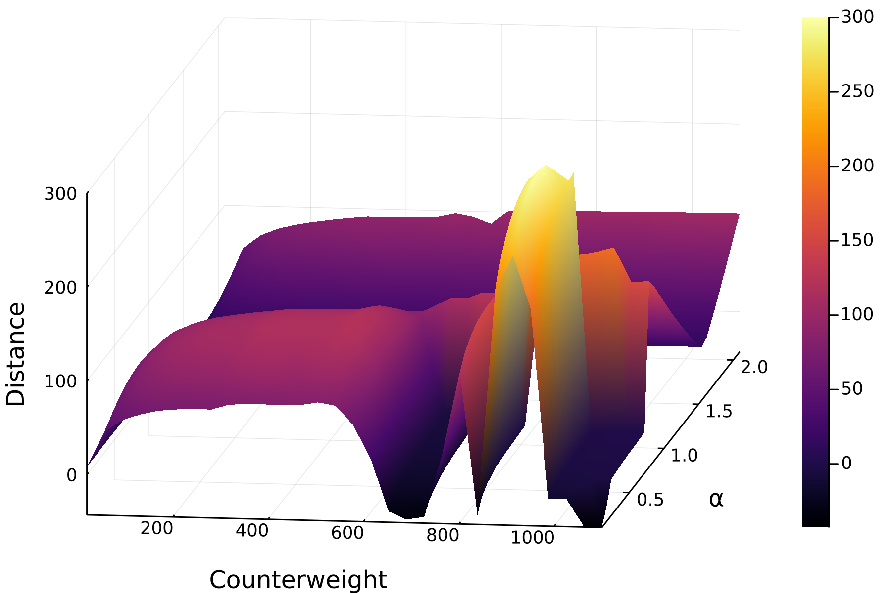

:::::: questions

## Questions

  - "What are for and while loops?"
  - "What is a comprehension?"

::::::

:::::: objectives

## Objectives


::::::

Before starting to work in a new document, Melissa has to:

Activate her environment

````julia
using Pkg
Pkg.activate(joinpath(@__DIR__, "projects", "trebuchet"))
Pkg.instantiate()
````

````
  Activating project at `~/projects/trebuchet`

````

Importing the package under its modified name

````julia
import Trebuchet as Trebuchets
````

Defining the structures

````julia
mutable struct Trebuchet <: AbstractVector{Float64}
  counterweight::Float64
  release_angle::Float64
end

struct Environment
  wind::Float64
  target_distance::Float64
end

Base.size(::Trebuchet) = tuple(2)
function Base.getindex(trebuchet::Trebuchet, i::Int)
    if i === 1
        return trebuchet.counterweight
    elseif i === 2
        return trebuchet.release_angle
    else
        error("Trebuchet only accepts indices 1 and 2, yours is $i")
    end
end
function Base.setindex!(trebuchet::Trebuchet, v, i::Int)
     if i === 1
         trebuchet.counterweight = v
    elseif i === 2
        trebuchet.release_angle = v
    else
        error("Trebuchet only accepts indices 1 and 2, yours is $i")
    end
end
function shoot_distance(trebuchet::Trebuchet, env::Environment)
     shoot_distance(env.wind, trebuchet.release_angle, trebuchet.counterweight)
end
function shoot_distance(args...) # slurping
     Trebuchets.shoot(args...)[2] # splatting
end
````

````output
shoot_distance (generic function with 2 methods)
````

Now Melissa knows how to shoot the virtual trebuchet and get the distance of
the projectile, but in order to aim she needs to take a lot of trial shots in a
row.
She wants her trebuchet to only shoot a hundred meters.

She could execute the function several times on the REPL with different
parameters, but that gets tiresome quickly.
A better way to do this is to use loops.

### Random search

The first thing that comes to her mind is to randomly sample points of the parameter space of the trebuchet.
The function `rand()` will give her a random number between 0 and 1 that is uniformly distributed.
So

````julia
Trebuchet( rand() * 500, rand() * pi/2 )
````

````output
2-element Trebuchet:
 199.20577943788413
   1.3175676282878894
````

will give her a Trebuchet with a weight between 0 and 500 and a release angle between 0 and pi/2 radians at random.

Now she can store the results of 3 random trebuchets in an array like this

````julia
env = Environment(5, 100)
distances = [shoot_distance(Trebuchet(rand() * 500, rand() * pi / 2), env) for _ in 1:3]
````

````output
3-element Vector{Float64}:
 109.63015948619828
  26.241893505479297
  42.721289252273955
````

This is called an _array comprehension_.
To get the information of the parameters and the results in one place she writes that again a bit differently

````julia
N = 10
weights = [rand() * 500 for _ in 1:N]
angles = [rand() * pi/2 for _ in 1:N]
distances = [(w,a) => shoot_distance(Trebuchet(w, a), env) for (w, a) in zip(weights, angles)]
````

````output
10-element Vector{Pair{Tuple{Float64, Float64}, Float64}}:
 (190.20671680295277, 0.46833555853995784) => 105.35107143909875
   (478.1865359891392, 0.5300556485613425) => 118.30720084397312
  (486.93150499743587, 0.3266640654580006) => 109.46465880298848
 (482.14935572302176, 0.12719150178861877) => 84.4818142924443
   (19.24228958100732, 1.1311868010145723) => 3.0834927704117057
  (233.70715374384997, 0.9844292611959172) => 92.48538338520068
   (322.8906658023918, 0.3793433438873054) => 110.49554634124097
   (70.71586061650947, 1.3112085094572539) => 33.712397304286064
  (369.04715755142337, 0.7897355893853809) => 112.25274271811487
   (417.9989625732521, 1.3286071027399737) => 47.89370694935854
````

### Gradient descent

That is working out so far, but Melissa wonders if she can improve her parameters more systematically.

:::::: callout

## Digression: Gradients

The `shoot_distance` function takes three input parameters and returns one
value (the distance).
Whenever we change one of the input parameters, we will get a different
distance.

The [_gradient_](https://en.wikipedia.org/wiki/Gradient) of a function gives the direction in which the return
value will change when each input value changes.

Since the `shoot_distance` function has three input parameters, the gradient
of `shoot_distance` will return a 3-element `Array`:
one direction for each input parameter.

Thanks to [automatic differentiation](https://en.wikipedia.org/wiki/Automatic_differentiation) and the Julia package
`ForwardDiff.jl` gradients can be calculated easily.

::::::

Melissa uses the `gradient` function of `ForwardDiff.jl` to get the direction
in which she needs to change the parameters to make the largest difference.

:::::: challenge

## Do you remember?

What does Melissa need to write into the REPL to install the package
`ForwardDiff`?

 1. `] install ForwardDiff`
 2. `add ForwardDiff`
 3. `] add ForwardDiff.jl`
 4. `] add ForwardDiff` <!---correct-->

:::::: solution

## Solution

The correct solution is 4:
<kbd>]</kbd> to enter pkg mode, then

````julia
pkg> add ForwardDiff
````

::::::


::::::

````julia
using ForwardDiff: gradient


imprecise_trebuchet = Trebuchet(500.0, 0.25pi);
environment = Environment(5.0, 100.0);

grad = gradient(x ->(shoot_distance([environment.wind, x[2], x[1]])
                      - environment.target_distance),
                imprecise_trebuchet)
````

````output
2-element Vector{Float64}:
  -0.12516519503998055
 -49.443442438172205
````

Melissa now changes her arguments a little bit in the direction of the gradient
and checks the new distance.

````julia
better_trebuchet = imprecise_trebuchet - 0.05 * grad;

shoot_distance([5, better_trebuchet[2], better_trebuchet[1]])
````

````output
-2.785549535224487
````

Great! That didn't shoot past the target, but instead it landed a bit too short.

:::::: challenge

## Experiment

How far can you change the parameters in the direction of the gradient, such
that it still improves the distance?

:::::: solution

## Try a bunch of values!

````julia
better_trebuchet = imprecise_trebuchet - 0.04 * grad
shoot_distance([environment.wind, better_trebuchet[2], better_trebuchet[1]])
120.48753521261001
````

````julia
better_trebuchet = imprecise_trebuchet - 0.03 * grad
shoot_distance([environment.wind, better_trebuchet[2], better_trebuchet[1]])
107.80646596787481
````

````julia
better_trebuchet = imprecise_trebuchet - 0.02 * grad
shoot_distance([environment.wind, better_trebuchet[2], better_trebuchet[1]])
33.90699307740854
````

````julia
better_trebuchet = imprecise_trebuchet - 0.025 * grad
shoot_distance([environment.wind, better_trebuchet[2], better_trebuchet[1]])
75.87613276409223
````

Looks like the "best" trebuchet for a target 100 m away will be between
2.5% and 3% down the gradient from the imprecise trebuchet.

::::::


::::::

### For loops

Now that Melissa knows it is going in the right direction she wants to automate
the additional iterations.
She writes a new function `aim`, that performs the application of the gradient
`N` times.

````julia
function aim(trebuchet, environment; N = 5, η = 0.05)
           better_trebuchet = copy(trebuchet)
           for _ in 1:N
               grad = gradient(x -> (shoot_distance([environment.wind, x[2], x[1]])
                                     - environment.target_distance),
                               better_trebuchet)
               better_trebuchet -= η * grad
           end
           return Trebuchet(better_trebuchet[1], better_trebuchet[2])
       end

better_trebuchet  = aim(imprecise_trebuchet, environment);

shoot_distance(environment.wind, better_trebuchet[2], better_trebuchet[1])
````

````output
-2.2195176928658915
````

:::::: challenge

## Explore

Play around with different inputs of `N` and `η`.
How close can you come?

:::::: solution

## Solution

This is a highly non-linear system and thus very sensitive.
The distances across different values for the counterweight and the release
angle α look like this:
{width="600" height="400" alt=""}

::::::


::::::

:::::: callout

## Aborting programs

If a call takes too long, you can abort it with `Ctrl-c`

::::::

### While loops

Melissa finds the output of the above `aim` function too unpredictable to be
useful.
That's why she decides to change it a bit.
This time she uses a `while`-loop to run the iterations until she is
sufficiently near her target.

(_Hint:_ __ε__ is `\epsilon`<kbd>tab</kbd>, and __η__ is `\eta`<kbd>tab</kbd>.)

````julia
function aim(trebuchet, environment; ε = 0.1, η = 0.05)
    better_trebuchet = copy(trebuchet)
    hit = x -> (shoot_distance([environment.wind, x[2], x[1]])
                          - environment.target_distance)
            while abs(hit(better_trebuchet)) > ε
                grad = gradient(hit, better_trebuchet)
                better_trebuchet -= η * grad
            end
            return Trebuchet(better_trebuchet[1], better_trebuchet[2])
        end

better_trebuchet = aim(imprecise_trebuchet, environment);

shoot_distance(better_trebuchet, environment)
````

````output
100.05601729579894
````

That is more what she had in mind. Your trebuchet may be tuned differently,
but it should hit just as close as hers.

:::::: keypoints

## Keypoints

  - "Use for loops for a known number of iterations and while loops for an unknown number of iterations."

::::::

